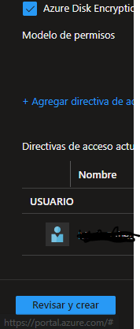
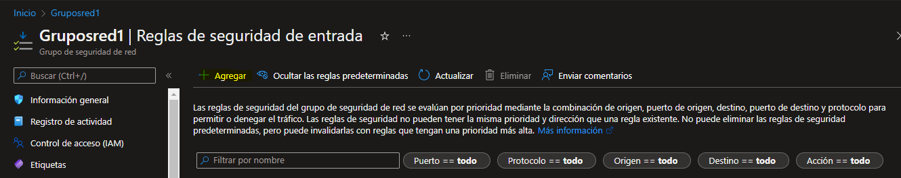
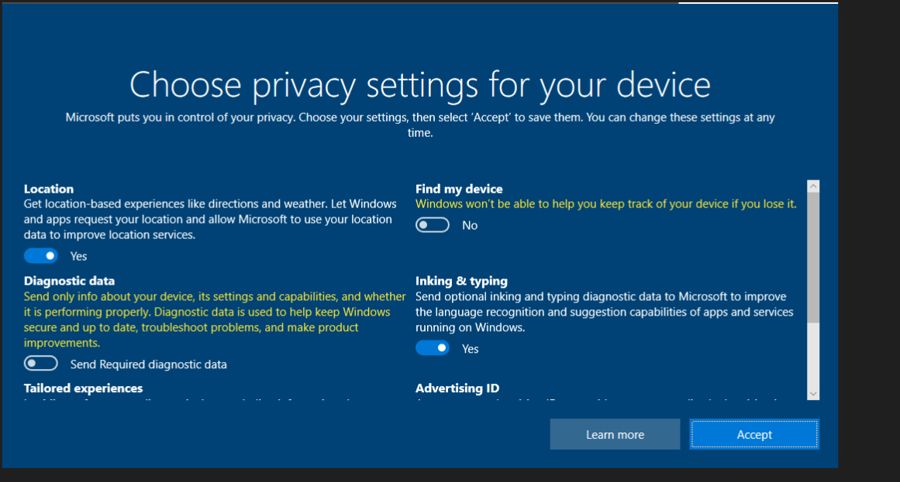

## Sesion 10

## Practica 1

CREACIÓN DE KEY VOLT

Ingresar al portal de azure y utilizar el buscador para encontrar el recurso

Crear el recurso 

Llenar los espacios con los datos correspondientes

Revisar y crear

Creacion de claves

Pulsar el siguiente botón

Completar los datos

Generacion de clave

Resultado 

**Nota** Cada una de las claves es una operacion 

Y descargas

Desde el apartado "secretos" es posible guardar contraseñas

Ir a 

Llenar los espacios correspondientes

Y crear

Contraseñas guardadas de manera segura

## Practica 2

Crear dos maquinas virtuales

Ir al apartado de redes y deshabilitar grupo de seguridad de red NIC

En el apartado de administración deshabilitar diagnóstico de arranque

Revisar y crear

Ir al recurso

Ir al apartado de redes

Ir al apartado “reglas de puerto de entrada” 

Crear un grupo de seguridad de red para personalizar las reglas de entrada

Crear el recurso 

Llenar los espacios y de preferencia seleccionar la misma región que en la máquina virtual

Crear

Ir al recurso 

Reglas de seguridad

Ir a interfaces de red y asociar 

Descargar archivo RDP

Abrir el archivo con escritorio remoto

La pantalla negra se debe a que se le quitaron todos los puertos a la máquina virtual

Agregar los puertos para que se pueda conectar

Abrir maquina virtual con escritorio remoto y llenar los datos

Maquina conectada

Aceptar todo

Agregar regla de salida

Rechazo de conexion a internet

# Sesion10
